# 📄 SDG pipeline for golden dataset generation

This project uses [`sdg_hub`](https://pypi.org/project/sdg-hub/) for generating synthetic queries and answers based on the documents provided.

The project processes pdf files containing individual documents into chunks of Markdown (`.md`) files , loads them into a dataset, and runs them through a configurable **query generation flow** using [`sdg_hub`](https://pypi.org/project/sdg-hub/) to generate queries and answers.


## Pre-requisites:
Before you run the pipeline, you need to do 2 things:
- Edit the required prompts for your usecase as following:
  (Current prompts are based on the usecase of technical literature present on redbooks.ibm.com)
   1. prompt_query.yaml: Required for the very first PromptBuilderBlock of the sdg flow named build_query_prompt. In this 
      prompt you need to describe how to create questions out of the given documents.
   2. prompt_answer.yaml: Required for the second PromptBuilderBlock of the sdg flow named build_answer_prompt. In this
      prompt you need to describe how to create answers for the generated queries using the given document.
   3. build_query_answerable_prompt.yaml: Required for the 3rd PromptBuilderBlock. This prompt is used to verify whether
      the generated query is answerable based on the given document. You have to provide a YES and NO sample.
   4. prompt_answer_faithful.yaml: Required for the 4th PromptBuilderBlock. This is used to judge whether the generated answers
      are faithful to the document. You have to provide an example of a faithful answer and an unfaithful answer with explanations.
- Have an LLM running somewhere (openai/ollama) and pass the api to the main script as a parameter api_base.
  Please refer the section in the end to run an openai compliant watson x interface for this purpose.
- See if you need to change the HEADER_FOOTER_PATTERNS constant in the convert_to_markdown.py file in case there are patterns in 
  your pdf you want to treat as noise.
## Usage
- Run the pipeline:
```
pip install sdg_hub
pip install pdfplumber
python convert_to_markdown.py
python main.py --flow_yaml FLOW_YAML --input_dir INPUT_DIR --output_dir OUTPUT_DIR --model MODEL --api_base API_BASE --api_key API_KEY
```
The command-line options are
```
  --flow_yaml FLOW_YAML
                        Path to the YAML file defining the flow.
  --input_dir INPUT_DIR
                        Directory containing Markdown files.
  --output_dir OUTPUT_DIR
                        Directory to save output files.
  --model MODEL         Model identifier to use for the flow.
  --api_base API_BASE   Base URL of the API.
  --api_key API_KEY     API key for authentication.

```
This will:
- Load and parse .md files from provided input folder.
- Initialize a flow from provided yaml file.
- Run the SDG HUB flow
- Save results to the provided output folder in a jsonl file

Now, to convert the jsonl file into a csv, run the following script:

```
python convert_to_csv.py output/golden_dataset.jsonl golden.csv
```
## Pipeline

```mermaid
sequenceDiagram
    participant Input as Input Dataset
    participant Query as Query Generation
    participant Answer as Answer Generation
    participant Answerable as Answerable
    participant Faithful as Faithful
    participant Output as Final Output

    Input ->> Query: document → generate_query
    Query ->> Answer: build_answer_prompt → generate_answer
    Query ->> Answerable: build_query_answerable_prompt → generate_query_answerable
    Answer ->> Faithful: build_answer_faithful_prompt → generate_answer_faithful
    Answerable ->> Output: valid_queries
    Faithful ->> Output: only_faithful_answers
```



## How to start OpenAI compliant watson x interface
- Clone the following repo: https://github.com/Niharika0306/watsonx-openai-api
- Following env vars are needed. The values for these env vars will change based on your location
  and project:
  export WATSONX_IAM_APIKEY="your-ibm-api-key"
  export WATSONX_PROJECT_ID="964263f4-5ae0-41e4-8030-874b79181552"
  export WATSONX_REGION="eu-gb"
- Build the image and run it:
```
cd fastapi-watsonx
docker build -t watsonxai-endpoint:1.1 .

docker run -d -p 8080:8000 --name watsonxai-endpoint \
-e WATSONX_IAM_APIKEY=${WATSONX_IAM_APIKEY} \
-e WATSONX_PROJECT_ID=${WATSONX_PROJECT_ID} \
-e WATSONX_REGION=${WATSONX_REGION} \
watsonxai-endpoint:1.1
```
You can check whether everything is working correctly by this curl request:
```
curl http://127.0.0.1:8080/v1/completions \
-H "Content-Type: application/json" \
-d '{
  "prompt": "Explain watsonx.ai advantages.",
  "max_tokens": 50,
  "temperature": 0.7
}'|jq
```

## 🤝 References
Inspired from the code by [Rudra Murthy](https://github.com/murthyrudra)
